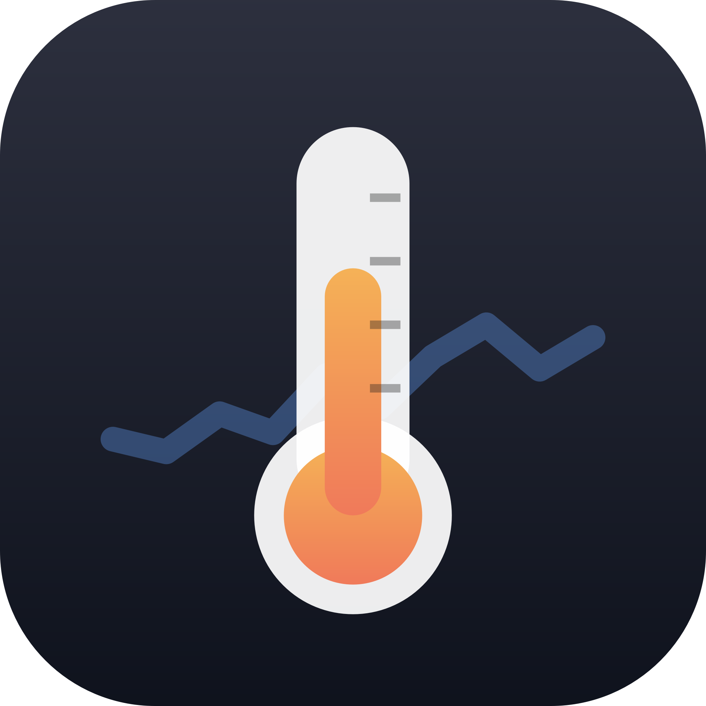
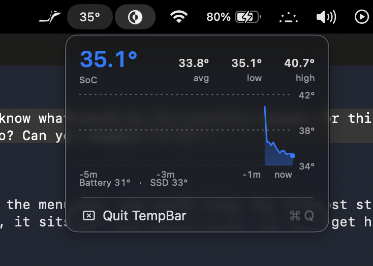

<p align="center">
  
</p>

<h1 align="center">TempBar</h1>

<p align="center">
  A tiny, dependency‑free macOS menu bar app that shows your Mac's SoC temperature — with a live 5‑minute chart.<br>
  <b>~200 lines of Swift · 0.1% CPU · no Homebrew, no Electron, no telemetry.</b>
</p>

<p align="center">
  
</p>

## Why

I wanted to see my MacBook's temperature in the menu bar without installing a full system‑monitor suite. TempBar reads the sensors directly through IOKit, updates every 3 seconds, and does nothing else.

## Features

- Current SoC (die) temperature in the menu bar — turns orange ≥ 75 °C, red ≥ 90 °C
- Dropdown with average / low / high over the last 5 minutes
- Live sparkline chart with temperature and time axes (keeps updating while open)
- Battery and SSD temperatures
- Launch‑at‑login toggle in the dropdown
- No dependencies, no background services — just one small `.app`

## Install

Requires macOS 14+ and Xcode Command Line Tools (`xcode-select --install`).

```sh
git clone https://github.com/vidhanm/TempBar.git
cd TempBar
./build.sh
cp -R TempBar.app /Applications/
open /Applications/TempBar.app
```

To start it automatically, click the temperature in the menu bar and tick **Launch at Login**.

## Notes on Apple Silicon sensors

On M4/M5 chips Apple no longer exposes sensors labelled "CPU" or "GPU"; the SoC reports a set of generic die sensors (`PMU tdie*`). TempBar shows the **hottest die sensor** — the number that governs thermal throttling — plus the average. This is the same data every monitoring tool has access to on these chips.

Tested on an M5 MacBook Air (macOS 26). Should work on any Apple Silicon Mac; Intel Macs are untested.

## How it works

`Sensors.swift` talks to the private `IOHIDEventSystemClient` API (the same one used by tools like Stats and macmon) to enumerate temperature sensors. `main.swift` is a plain AppKit `NSStatusItem` with a custom‑drawn `NSView` for the dropdown. `build.sh` compiles both with `swiftc` and wraps them in an `.app` bundle with an ad‑hoc signature.

## License

MIT
